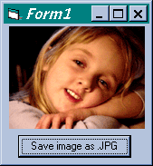



## Saving a JPG from an ImageView box\.

### Description

I searched PSC but could not find an example of how to save an image as a JPG. Using Intel® JPEG Library and the supplied DLL, this is a breeze. The JPG saves to App.Path, but you can modify this. Any questions please let me know.
 
### More Info
 

             |
---                |---
**Submitted On**   |2002-07-04 11:41:44
**By**             |[Chad Gutowsky](https://github.com/Planet-Source-Code/PSCIndex/blob/master/ByAuthor/chad-gutowsky.md)
**Level**          |Intermediate
**User Rating**    |5.0 (20 globes from 4 users)
**Compatibility**  |VB 5\.0, VB 6\.0
**Category**       |[Graphics](https://github.com/Planet-Source-Code/PSCIndex/blob/master/ByCategory/graphics__1-46.md)
**World**          |[Visual Basic](https://github.com/Planet-Source-Code/PSCIndex/blob/master/ByWorld/visual-basic.md)
**Archive File**   |[Saving\_a\_J101909742002\.zip](https://github.com/Planet-Source-Code/chad-gutowsky-saving-a-jpg-from-an-imageview-box__1-36562/archive/master.zip)

